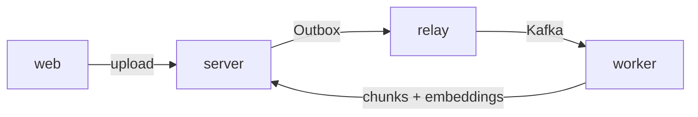
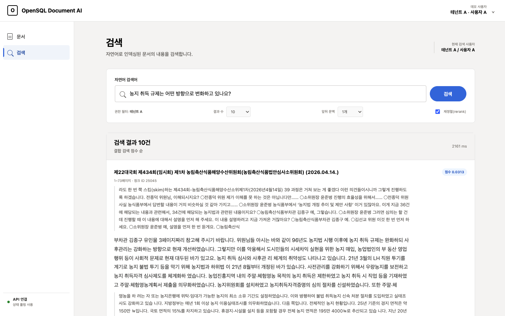
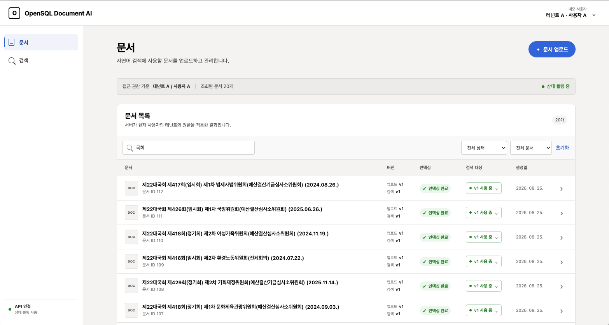

# AI Document Management System on Tmax OpenSQL

[한국어](README.md) | **English**


> 2026 Open Source Developer Contest · TmaxTibero corporate track

A document management system that **finds documents by meaning**. You do not need to remember the filename or the exact wording — describe what you are looking for and it surfaces the relevant passages.

The demo service is available [here](https://spr1n6-osscontest-web.vercel.app/). 🚀

---

## Overview

Documentation is how a team accumulates and shares context. But as documents pile up, the work around them — tracking file versions, converting them into a form AI can read, recovering jobs that went wrong — often becomes the bottleneck that eats the team's time.

This system takes that work off people's hands. Upload a file and you are done with it: the upload triggers indexing, and failed jobs retry on their own.

Five file types are accepted — PDF, DOCX, Markdown, HWP, TXT — and re-uploading the same document stacks it as a new version. To undo a change, roll back to an earlier version as the search target; upload a file whose contents match an existing version and the system tells you it is a duplicate. Who can see each document is decided per user and per tenant.

<br>

The system spans four source repositories. An uploaded document becomes searchable through the path below.



| Repository | Role |
|---|---|
| [server](https://github.com/mash-up-kr/spr1n6-osscontest-server) | API server. Handles upload, permissions, and search, and records Outbox events |
| [relay](https://github.com/mash-up-kr/spr1n6-osscontest-relay) | Reads Outbox rows and publishes them to Kafka |
| [worker](https://github.com/mash-up-kr/spr1n6-osscontest-worker) | Splits documents into chunks, embeds them, and stores the result |
| [web](https://github.com/mash-up-kr/spr1n6-osscontest-web) | React SPA |

This repository is `server`.

---

## Core features

### Semantic search

Documents are split into passages, indexed as 1536-dimensional vectors, and matched against the query through hybrid search (RRF). A passage is found when its meaning is close, even with no words in common. Combining this with morphological analysis, BM25, and reranking raised **Recall@10 from 0.31 to 0.79 on a synthetic QA evaluation set**.

An option returns the passages immediately before and after each hit, because a single passage on its own often carries too little context to judge.

The design and evaluation are written up in [Search design and evaluation](docs/SEARCH.en.md).



### Indexing that loses nothing

The upload response does not wait for indexing. Instead, the indexing request event is written **in the same atomic unit** as the transaction that stores the document.
A database trigger creates that event, so the application cannot forget to publish it, and if the write rolls back the event disappears with it.

From there the relay moves the event to Kafka and the worker picks it up. **Jobs that fail are retried automatically with a backoff.** Progress is visible in the UI in near real time, and a job that automatic retries could not recover can be retried by hand from a button.



### Tenant and per-document access control

A document is reachable only within the organization of the person who uploaded it. Uploading makes that person the document's admin, and members of the same organization start out able to read it. Nothing has to be configured for a team to share a document, and nothing leaks outside it.

Permissions widen and narrow easily — hand editing rights to one member, or pull a document open to the whole organization back to a handful of people. When someone is granted access through more than one path, the widest one applies.

Documents from another organization appear in neither listings nor search results. Opening one by a directly guessed link answers "document does not exist" rather than "permission denied", so even the existence of the document does not leak.

### Encryption at rest

User names and original filenames are encrypted in the database. The key is passed by the application as a session setting on each connection, so it never lives in the database.
On Tmax OpenCrypto the cipher is ARIA-256, a Korean national standard; where that algorithm is unavailable, AES-256 is used.

### MCP server

Document search and listing are exposed as MCP tools, so an AI client such as Claude can connect directly and answer from the documents you have collected. Tool calls pass the same permission checks as the REST API, so an agent is authorized exactly as its user is. See [Connecting an MCP server](#connecting-an-mcp-server).

---

## Getting started

### Requirements

- Docker & Docker Compose (v2.24 or later)
- An OpenAI API key — used to embed documents during indexing and to embed search queries

### Run

```bash
cp .env.example .env
# Open .env and fill in OPENAI_API_KEY. Everything else works at its default.

docker compose up -d --build
```

PostgreSQL, MinIO, Kafka, the API server, the relay, and the worker all come up together. The server applies the schema with Flyway as it starts.

Once the server is ready, this returns `UP`.

```bash
curl localhost:8080/actuator/health
```

### Demo data

This project issues no tokens; identity comes from the `X-User-Id` header. Without a seeded demo user every request fails with 401.

```bash
docker compose exec -T db psql \
  -U "${DB_USERNAME:-aidocs}" -d "${DB_NAME:-aidocs}" \
  -v key="${DB_ENCRYPTION_KEY:-local-only-throwaway-key}" -v cipher=aes256 \
  < scripts/seed-demo.sql
```

Running it repeatedly is safe. If you filled in `.env`, load it first with `set -a; . ./.env; set +a`, or substitute your values for the defaults above.

### Endpoints

| Target | Address |
|---|---|
| API | `http://localhost:8080` |
| MinIO console | `http://localhost:9011` |
| Kafka UI | `http://localhost:8081` |

### Shut down

```bash
docker compose down        # stops the containers
docker compose down -v     # also deletes the data
```

### Environment variables

`OPENAI_API_KEY` is the only value you must supply. Leave the rest blank and defaults apply.

| Variable | Required | Description |
|---|:--:|---|
| `OPENAI_API_KEY` | Yes | Used to generate embeddings |
| `DB_ENCRYPTION_KEY` | No | Key for encrypting user names and filenames. The default is for local use only |
| `COHERE_API_KEY` | No | Used to rerank search results. Without it, results are returned in RRF order without reranking |
| `SERVER_HOST_PORT` | No | API port (default 8080) |
| `CORS_ALLOWED_ORIGINS` | No | Allowed origins (default `http://localhost:5173`) |

The full list is in [`.env.example`](.env.example).

---

## Connecting an MCP server

Search and document lookup are exposed as MCP (Model Context Protocol) tools, so a client such as Claude Code can call them over a standard protocol. Implemented with Spring AI MCP (Streamable HTTP).

### Tools

| Tool | What it does |
|---|---|
| `search_documents` | Runs hybrid search (vector similarity + keyword matching) for a query. Returns matching chunks along with surrounding context and the owning document |
| `list_documents` | Lists the documents in the tenant with cursor-based pagination |
| `get_document` | Fetches a document's detail directly by `documentId`, without searching |

Parameters are documented in [API specification, section 10](docs/API_SPEC.en.md).

### Usage

Register the endpoint and the auth header in your MCP client configuration.

```json
{
  "mcpServers": {
    "search": {
      "type": "http",
      "url": "http://localhost:8080/mcp",
      "headers": { "X-Search-User-Id": "your_app_user_id" }
    }
  }
}
```

- The endpoint is `/mcp` and communicates over Streamable HTTP.
- `X-Search-User-Id` identifies the tenant and is required. A missing or non-numeric value is rejected as an authentication failure. Note that this is a different header from `X-User-Id`, which the REST API uses.

Once connected, the LLM turns natural-language requests ("find the documents about the budget") into tool calls on its own.

---

## Tech stack

| Category   | Technology                  | Version |
|------------|-----------------------------|--------|
| Language   | Kotlin                      | 2.3.21 |
| Runtime    | Java (JVM)                  | 21 LTS |
| Framework  | Spring Boot                 | 4.1.0  |
| ORM        | Spring Data JPA / Hibernate | 4.1.0 / 7.4.1 |
| Build      | Gradle (Kotlin DSL)         | 9.5.1  |
| DB (dev)   | Tmax OpenSQL + pgvector     | v3.0 / 0.8.1 |
| DB (local) | PostgreSQL + pgvector       | 17.8 / 0.8.1 |
| Driver     | PostgreSQL JDBC             | 42.7.11 |

---

## Documentation

- [Contributing](CONTRIBUTING.en.md) — branches, commit messages, pull requests
- [Development guide](docs/DEVELOPMENT.en.md) — per-profile workflow, migrations, environment variables
- [Search design and evaluation](docs/SEARCH.en.md) — hybrid search design, evaluation method, results
- [Code conventions](docs/CODE_CONVENTIONS.en.md)
- [API specification](docs/API_SPEC.en.md)
- [Database schema](docs/SCHEMA.en.md) — tables, state transitions, write ownership

---

## License

This project is licensed under the MIT License. See [LICENSE](LICENSE) for details.

### Open source used

| Project | License |
|---|---|
| Spring Boot | Apache-2.0 |
| Kotlin | Apache-2.0 |
| PostgreSQL | PostgreSQL License |
| PostgreSQL JDBC Driver | BSD-2-Clause |
| Hibernate ORM | Apache-2.0 |
| pgvector | PostgreSQL License |
| Apache Kafka | Apache-2.0 |
| MinIO | AGPL-3.0 |

Tmax OpenSQL is a commercial TmaxTibero product and is not included in this repository.
