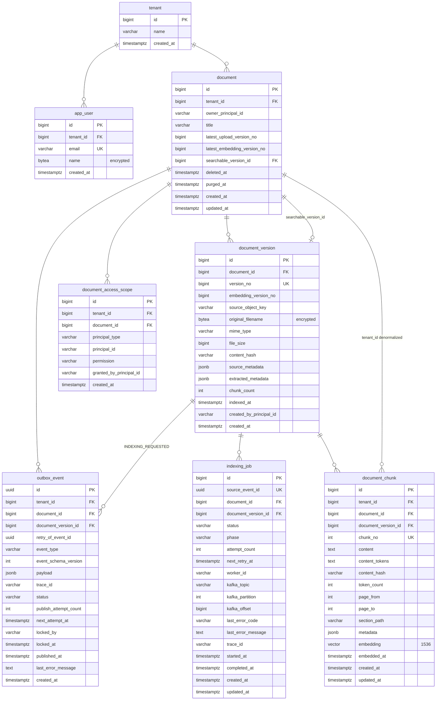

[한국어](SCHEMA.md) | **English**

# Database Schema

| Item              | Value                                               |
|-------------------|-------------------------------------------------|
| Base migration    | `V20260825_001__add_document_chunk_content_tokens.sql` |
| Last updated      | 2026-08-26                                      |
| Target DB         | PostgreSQL 17.8 (local) / Tmax OpenSQL v3.0 (dev) |

The schema is owned by the API server repository; the relay and worker read and write it without running migrations.
State transitions were written by cross-checking the code of all three repositories — server `5d35737`, relay `d83e82d`, worker `029527c`.

---

## 1. Overall structure

---

## 2. Tables

### 2.1 `tenant`

Tenant. The isolation unit for all data.

| Column       | Type           | Constraints        | Description |
|--------------|----------------|---------------------|-------|
| `id`         | `BIGINT`       | PK, identity        |       |
| `name`       | `VARCHAR(100)` | `NOT NULL`          |       |
| `created_at` | `TIMESTAMPTZ`  | `NOT NULL`, defaults to now |       |

### 2.2 `app_user`

User. Named `app_user` because `user` is a reserved word in PostgreSQL.

| Column       | Type           | Constraints                          | Description                    |
|--------------|----------------|---------------------------------------|-----------------------|
| `id`         | `BIGINT`       | PK, identity                          |                       |
| `tenant_id`  | `BIGINT`       | `NOT NULL`, FK → `tenant(id)`         |                       |
| `email`      | `VARCHAR(255)` | `NOT NULL`, `(tenant_id, email)` UK   | Plaintext. Used for the UNIQUE constraint and login lookups |
| `name`       | `BYTEA`        | `NOT NULL`                            | Subject to encryption |
| `created_at` | `TIMESTAMPTZ`  | `NOT NULL`, defaults to now           |                       |

### 2.3 `document`

Document. Holds a version counter and a deletion timestamp.

| Column                          | Type             | Constraints                                                   | Description                                          |
|---------------------------------|------------------|-----------------------------------------------------------------|---------------------------------------------|
| `id`                            | `BIGINT`         | PK, identity                                                    |                                             |
| `tenant_id`                     | `BIGINT`         | `NOT NULL`, FK → `tenant(id)`, `(id, tenant_id)` UK             | Target of composite FKs from child tables            |
| `owner_principal_id`            | `VARCHAR(255)`   | `NOT NULL`                                                      |                                             |
| `title`                         | `VARCHAR(255)`   | `NOT NULL`                                                      |                                             |
| `latest_upload_version_no`      | `BIGINT`         | `NOT NULL`, default `0`, `>= 0`                                  | The last `version_no` issued. Counter for numbering the next version |
| `latest_embedding_version_no`   | `BIGINT`         | `NOT NULL`, default `0`, `>= 0`, `<= latest_upload_version_no`   | The most recent `version_no` for which embedding has completed |
| `searchable_version_id`         | `BIGINT`         | FK → `document_version(id, document_id)`                       | The version used for search. Can only point to a version at or below `latest_embedding_version_no` |
| `deleted_at`                    | `TIMESTAMPTZ`    |                                                                  | Timestamp when deletion was requested                |
| `purged_at`                     | `TIMESTAMPTZ`    | value allowed only when `deleted_at IS NOT NULL`                | Timestamp when physical cleanup completed            |
| `created_at` / `updated_at`     | `TIMESTAMPTZ`    | `NOT NULL`, defaults to now                                     |                                             |

### 2.4 `document_version`

Upload unit. Each upload of a document is one row.

| Column                      | Type              | Constraints                                                     | Description                |
|-----------------------------|-------------------|--------------------------------------------------------------------|-------------------|
| `id`                        | `BIGINT`          | PK, identity, `(id, document_id)` UK                               |                   |
| `document_id`               | `BIGINT`          | `NOT NULL`, FK → `document(id)`                                    |                   |
| `version_no`                | `BIGINT`          | `NOT NULL`, `> 0`, `(document_id, version_no)` UK                  | Sequence number within the document |
| `embedding_version_no`      | `BIGINT`          | `NOT NULL`, `> 0`                                                  | Determines the order for promoting the search version. The API server fills it with the same value as `version_no` |
| `source_object_key`         | `VARCHAR(1024)`   | `NOT NULL`                                                         | Object storage key of the original file |
| `original_filename`         | `BYTEA`           | `NOT NULL`                                                         | Subject to encryption |
| `mime_type`                 | `VARCHAR(100)`    | `NOT NULL`                                                         |                   |
| `file_size`                 | `BIGINT`          | `NOT NULL`, `>= 0`                                                 | Bytes             |
| `content_hash`              | `VARCHAR(128)`    | `NOT NULL`                                                         |                   |
| `source_metadata`           | `JSONB`           |                                                                     | Metadata received together with the upload |
| `extracted_metadata`        | `JSONB`           |                                                                     | Metadata generated by AI |
| `chunk_count`                | `INTEGER`         | `NULL` or `>= 0`                                                   | Filled in by the worker at the publish stage |
| `indexed_at`                | `TIMESTAMPTZ`     |                                                                     | Filled in by the worker together with `chunk_count` |
| `created_by_principal_id`   | `VARCHAR(255)`    | `NOT NULL`                                                         |                   |
| `created_at`                | `TIMESTAMPTZ`     | `NOT NULL`, defaults to now                                        |                   |

### 2.5 `document_chunk`

Search unit. Holds both the embedding and keyword tokens. `tenant_id` is a column denormalized down from `document`.

| Column                        | Type              | Constraints                                                    | Description                                          |
|-------------------------------|-------------------|--------------------------------------------------------------------|-----------------------------------------------|
| `id`                          | `BIGINT`          | PK, identity                                                        |                                               |
| `tenant_id`                   | `BIGINT`          | `NOT NULL`, `(document_id, tenant_id)` FK → `document`              |                                               |
| `document_id`                 | `BIGINT`          | `NOT NULL`                                                          |                                               |
| `document_version_id`         | `BIGINT`          | `NOT NULL`, `(document_version_id, document_id)` FK                 |                                               |
| `chunk_no`                    | `INTEGER`         | `NOT NULL`, `>= 0`, `(document_version_id, chunk_no)` UK            | Sequence number within the version                    |
| `content`                     | `TEXT`            | `NOT NULL`                                                          | Raw chunk text                                       |
| `content_tokens`              | `TEXT`            |                                                                      | Tokens normalized by Nori morphological analysis (space-separated). Excluded from keyword candidate lookup when `NULL` |
| `content_hash`                | `VARCHAR(128)`    | `NOT NULL`                                                          |                                               |
| `token_count`                 | `INTEGER`         | `NULL` or `>= 0`                                                    |                                               |
| `page_from` / `page_to`       | `INTEGER`         | if both are present, `page_from <= page_to`                        |                                               |
| `section_path`                | `VARCHAR(1024)`   |                                                                      |                                               |
| `metadata`                    | `JSONB`           |                                                                      |                                               |
| `embedding`                   | `VECTOR(1536)`    | `NOT NULL`                                                          | Target of the HNSW cosine index                       |
| `embedded_at`                 | `TIMESTAMPTZ`     | `NOT NULL`                                                          |                                               |
| `created_at` / `updated_at`   | `TIMESTAMPTZ`     | `NOT NULL`, defaults to now                                         |                                               |

### 2.6 `document_access_scope`

Document access permissions. Document lookup and search reference only this table.

| Column                      | Type             | Constraints                                                          | Description                               |
|-----------------------------|------------------|-------------------------------------------------------------------------|------------------------------------------|
| `id`                        | `BIGINT`         | PK, identity                                                            |                                          |
| `tenant_id`                 | `BIGINT`         | `NOT NULL`, `(document_id, tenant_id)` FK → `document`                  |                                          |
| `document_id`               | `BIGINT`         | `NOT NULL`                                                              |                                          |
| `principal_type`            | `VARCHAR(30)`    | `NOT NULL`, `USER` / `TENANT`                                           |                                          |
| `principal_id`              | `VARCHAR(255)`   | `NOT NULL`, `(document_id, principal_type, principal_id)` UK           | The string form of `tenant_id` when `TENANT` |
| `permission`                | `VARCHAR(20)`    | `NOT NULL`, default `READ`, `READ` / `WRITE` / `ADMIN`                  |                                          |
| `granted_by_principal_id`   | `VARCHAR(255)`   | `NOT NULL`                                                              |                                          |
| `created_at`                | `TIMESTAMPTZ`    | `NOT NULL`, defaults to now                                             |                                          |

### 2.7 `outbox_event`

Transactional outbox. The relay server polls it and publishes.

| Column                    | Type             | Constraints                                                | Description                                              |
|---------------------------|------------------|--------------------------------------------------------------|-----------------------------------------------------------|
| `id`                      | `UUID`           | PK                                                            | Filled in by the trigger via `gen_random_uuid()`           |
| `tenant_id`               | `BIGINT`         | `NOT NULL`, `(document_id, tenant_id)` FK → `document`        |                                                            |
| `document_id`             | `BIGINT`         | `NOT NULL`                                                    |                                                            |
| `document_version_id`     | `BIGINT`         | `(document_version_id, document_id)` FK                       | Has a value for `INDEXING_REQUESTED`; `NULL` for `DOCUMENT_DELETED` |
| `retry_of_event_id`       | `UUID`           |                                                               | The original event a republish points back to. `NULL` for a new event |
| `event_type`              | `VARCHAR(50)`    | `NOT NULL`, `INDEXING_REQUESTED` / `DOCUMENT_DELETED`         |                                                            |
| `event_schema_version`    | `INTEGER`        | `NOT NULL`, default `1`, `> 0`                                |                                                            |
| `payload`                 | `JSONB`          | `NOT NULL`                                                    |                                                            |
| `trace_id`                | `VARCHAR(255)`   |                                                               | The value passed via `SET LOCAL app.trace_id` within the transaction |
| `status`                  | `VARCHAR(20)`    | `NOT NULL`, default `PENDING`                                 | See section 3                                              |
| `publish_attempt_count`   | `INTEGER`        | `NOT NULL`, default `0`, `>= 0`                               |                                                            |
| `next_attempt_at`         | `TIMESTAMPTZ`    | `NOT NULL`, defaults to now                                   | Eligible for publishing from this time onward. On a `DEAD` row, `'infinity'` means a human has paused it |
| `locked_by`               | `VARCHAR(255)`   |                                                               | The relay instance that picked up this row                 |
| `locked_at`               | `TIMESTAMPTZ`    |                                                               | Timestamp when it changed to `PUBLISHING`. Basis for reclaiming rows that died mid-publish |
| `published_at`            | `TIMESTAMPTZ`    |                                                               |                                                            |
| `last_error_message`      | `TEXT`           |                                                               |                                                            |
| `created_at`              | `TIMESTAMPTZ`    | `NOT NULL`, defaults to now                                   |                                                            |

### 2.8 `indexing_job`

The worker's indexing processing history.

| Column                        | Type             | Constraints                                            | Description                              |
|-------------------------------|------------------|-----------------------------------------------------------|---------------------------------|
| `id`                          | `BIGINT`         | PK, identity                                              |                                 |
| `source_event_id`             | `UUID`           | `NOT NULL`, UK                                            | The original outbox event. No FK is set (see section 4) |
| `document_id`                 | `BIGINT`         | `NOT NULL`, `(document_version_id, document_id)` FK       |                                 |
| `document_version_id`         | `BIGINT`         | `NOT NULL`                                                |                                 |
| `status`                      | `VARCHAR(30)`    | `NOT NULL`                                                | See section 3                    |
| `phase`                       | `VARCHAR(30)`    |                                                            | Current processing stage. `DOWNLOADING` / `PARSING` / `CHUNKING` / `EMBEDDING` |
| `attempt_count`               | `INTEGER`        | `NOT NULL`, default `0`, `>= 0`                           |                                 |
| `next_retry_at`               | `TIMESTAMPTZ`    |                                                            |                                 |
| `worker_id`                   | `VARCHAR(255)`   |                                                            |                                 |
| `kafka_topic`                 | `VARCHAR(255)`   | `NOT NULL`, no blanks allowed                             | The topic of the received Kafka record |
| `kafka_partition`             | `INTEGER`        | `NOT NULL`, `>= 0`                                        |                                 |
| `kafka_offset`                | `BIGINT`         | `NOT NULL`, `>= 0`                                        |                                 |
| `last_error_code`             | `VARCHAR(100)`   |                                                            | The failure code classified by the worker. `MAX_ATTEMPTS_EXCEEDED` / `DOCUMENT_DELETED` are fixed values |
| `last_error_message`          | `TEXT`           |                                                            |                                 |
| `trace_id`                    | `VARCHAR(255)`   |                                                            |                                 |
| `started_at`                  | `TIMESTAMPTZ`    |                                                            |                                 |
| `completed_at`                | `TIMESTAMPTZ`    |                                                            |                                 |
| `created_at` / `updated_at`   | `TIMESTAMPTZ`    | `NOT NULL`, defaults to now                               |                                 |

---

## 3. Status values

### `outbox_event.status`

The relay repository (`doc-relay`) is what transitions the value. The API server only inserts `PENDING` rows via a trigger.

| Value        | Meaning                                                    |
|--------------|-------------------------------------------------------------|
| `PENDING`    | Waiting to be published. Rows where `next_attempt_at <= now()` are eligible to be claimed |
| `PUBLISHING` | Claimed by the relay and being published. `locked_by` / `locked_at` are filled in together |
| `PUBLISHED`  | Kafka has acknowledged receipt                                |
| `DEAD`       | Publishing has stopped. Not a terminal state — only rows paused due to permanent failure are excluded from automatic recovery |

| Transition                          | Trigger                                                                 |
|--------------------------------------|--------------------------------------------------------------------------|
| `PENDING` → `PUBLISHING`             | Claimed by the relay (`FOR UPDATE SKIP LOCKED`)                          |
| `PUBLISHING` → `PUBLISHED`           | Kafka acknowledges receipt                                                |
| `PUBLISHING` → `PENDING`             | A retryable failure. Increments `publish_attempt_count` and pushes `next_attempt_at` back by the backoff interval |
| `PUBLISHING` → `DEAD` (accumulated transient failures) | Retry limit reached. `next_attempt_at` is set to a recovery time, so it automatically revives later |
| `PUBLISHING` → `DEAD` (permanent failure) | A failure whose outcome wouldn't change on retry. Paused after a single attempt by setting `next_attempt_at = 'infinity'` |
| `PUBLISHING` → `PENDING` (reclaim)   | Rows whose `locked_at` has exceeded the lock timeout. Always goes to `PENDING`, never `DEAD`, even past the retry limit |
| `DEAD` → `PENDING`                   | The recovery scheduler revives rows where `next_attempt_at <= now()`. The attempt count is reset to `0` |
| `DEAD` → `PENDING` (manual)          | Manual admin republish. Reverts the same row rather than creating a new one |
| `PUBLISHED` → `PENDING` (manual)     | Manual admin forced republish. Resends messages that were lost — despite the record saying otherwise — e.g. due to a broker restart |

There are two kinds of `DEAD`, distinguished by `next_attempt_at`.

| `next_attempt_at` | Meaning                                             |
|--------------------|------------------------------------------------------|
| a timestamp        | Once that time passes, the recovery scheduler automatically revives it to `PENDING` |
| `'infinity'`       | A row judged a permanent failure, or paused by a human. It won't revive until the pause is lifted |

What's classified as a permanent failure: envelope-assembly failure, plus three Kafka exceptions — `RecordTooLargeException` / `TopicAuthorizationException` / `InvalidTopicException` — four in total. Failures without certainty are left as transient.

### `indexing_job.status`

The worker repository is what transitions the value. The API server only reads it.

| Value        | Meaning                    |
|--------------|-----------------------------|
| `PENDING`    | Right after receiving the Kafka record, before processing |
| `PROCESSING` | Being processed by the worker |
| `RETRY_WAIT` | Waiting until `next_retry_at` after a failure |
| `COMPLETED`  | Completed                    |
| `FAILED`     | Final failure                |

| Transition                                       | Trigger                                                                  |
|----------------------------------------------------|-----------------------------------------------------------------------|
| (none) → `PENDING`                                 | Inserted with `ON CONFLICT DO NOTHING` upon receiving `INDEXING_REQUESTED` |
| `PENDING` / `PROCESSING` / `RETRY_WAIT` → `PROCESSING` | Processing starts. Increments `attempt_count` and stamps `worker_id`. If `attempt_count` is already at the cap, the claim itself fails |
| `PROCESSING` → `RETRY_WAIT`                        | A retryable failure. Stamps `next_retry_at`                             |
| `PROCESSING` → `COMPLETED`                         | Publishing completed. Overwritten without a guard                       |
| `PROCESSING` → `FAILED`                            | Retry limit reached, or a non-retryable failure                         |
| `PENDING` / `PROCESSING` → `FAILED`                | Terminates rows whose claim is blocked because the cap was exceeded. `last_error_code = 'MAX_ATTEMPTS_EXCEEDED'` |
| `PENDING` / `PROCESSING` / `RETRY_WAIT` → `FAILED` | Terminates an active job because the document was deleted. `last_error_code = 'DOCUMENT_DELETED'` |

A partial unique index ensures only one job in `PENDING` / `PROCESSING` / `RETRY_WAIT` can exist per `document_version`.

### `indexing_job.phase`

The processing stage is recorded right before entering each stage.

`DOWNLOADING` → `PARSING` → `CHUNKING` → `EMBEDDING`

---

## 4. Reference rules

- **Tenant isolation**: child tables reference `document` via a composite `(document_id, tenant_id)` FK. `document_id` alone cannot attach a document belonging to a different tenant.
- **Version consistency**: chunks, jobs, and outbox events use a composite `(document_version_id, document_id)` FK.
- **`searchable_version_id`**: a back-reference FK from `document` to `document_version`. Added via `ALTER TABLE` after `document_version` is created.
- **`indexing_job.source_event_id`**: no FK is set. Outbox rows need to be cleanable after publishing, but job history is kept around longer.

---

## 5. Write ownership

Three repositories share one schema. Since which side writes differs by column, here's a summary.

| Target                                                                 | Writer   |
|--------------------------------------------------------------------------|---------|
| All migrations                                                            | API server  |
| `tenant`, `app_user`, `document_access_scope`                            | API server  |
| `document` creation, `title`, `latest_upload_version_no`, `deleted_at`    | API server  |
| `document_version` insert (including `embedding_version_no`)             | API server  |
| `outbox_event` insert                                                     | DB trigger  |
| `outbox_event` status/lock/retry columns                                 | Relay     |
| `outbox_event.retry_of_event_id`                                          | API server (on an indexing retry request) |
| All of `indexing_job`                                                     | Worker  |
| All of `document_chunk`                                                   | Worker  |
| `document_version.chunk_count`, `indexed_at`                             | Worker  |
| `document.searchable_version_id`, `latest_embedding_version_no`          | Worker  |

**Promotion rule**: the worker promotes a candidate version only when its `embedding_version_no` is greater than that of the current `searchable_version_id`. Deleted documents (`deleted_at IS NOT NULL`) are excluded from promotion, so an old job that finishes late can't roll the search version backward.

**Deletion cleanup**: the worker sweeps documents that have `deleted_at` set but still have chunks remaining, and deletes their `document_chunk` rows. Once the chunks are gone, the document is no longer picked up by the next sweep, so running the same sweep repeatedly produces the same result.

---

## 6. Indexes

| Index                                    | Target                                                   | Purpose                    |
|--------------------------------------------|------------------------------------------------------------|-----------------------|
| `idx_document_tenant_active`              | `document (tenant_id, id) WHERE deleted_at IS NULL`         | Tenant document listing             |
| `idx_document_pending_purge`              | `document (deleted_at) WHERE deleted_at IS NOT NULL AND purged_at IS NULL` | Deletion cleanup scan               |
| `idx_document_version_document`           | `document_version (document_id, version_no DESC)`           | Version listing                 |
| `idx_outbox_pending`                      | `outbox_event (next_attempt_at, id) WHERE status = 'PENDING'` | Relay polling                |
| `idx_outbox_stuck`                        | `outbox_event (locked_at) WHERE status = 'PUBLISHING'`      | Reclaiming zombie rows               |
| `idx_outbox_indexing_event_version`       | `outbox_event (document_version_id, created_at DESC) WHERE event_type = 'INDEXING_REQUESTED'` | Looking up indexing events per version        |
| `uq_indexing_job_active_version`          | `indexing_job (document_version_id) WHERE status IN ('PENDING','PROCESSING','RETRY_WAIT')` | Preventing duplicate in-progress jobs (UNIQUE) |
| `idx_indexing_job_retry`                  | `indexing_job (status, next_retry_at) WHERE status IN ('PENDING','RETRY_WAIT')` | Looking up retry candidates             |
| `idx_indexing_job_version`                | `indexing_job (document_version_id, created_at DESC)`        | Indexing history per version            |
| `idx_chunk_document_version`              | `document_chunk (document_version_id, chunk_no)`             | Looking up chunks per version             |
| `idx_document_chunk_embedding_hnsw`       | `document_chunk USING hnsw (embedding vector_cosine_ops)`, `m = 16`, `ef_construction = 64` | Vector similarity search             |
| `idx_document_chunk_content_tokens_tsv`   | `document_chunk USING GIN (to_tsvector('simple', content_tokens))` | Keyword candidate retrieval (BM25 path)   |
| `idx_document_chunk_content_tsv`          | `document_chunk USING GIN (to_tsvector('simple', content))` | Keyword search over raw content (fallback path)  |
| `idx_access_scope_principal`              | `document_access_scope (tenant_id, principal_type, principal_id, document_id)` | Looking up documents the principal has access to |

---

## 7. Triggers

| Trigger                           | Timing                                                       | Action                                                              |
|-------------------------------------|--------------------------------------------------------------|--------------------------------------------------------------------|
| `trg_document_version_outbox`     | `AFTER INSERT ON document_version`                            | Inserts an `INDEXING_REQUESTED` outbox row, then `pg_notify('outbox_event', <id>)` |
| `trg_document_deleted_outbox`     | `AFTER UPDATE ON document` (only when `deleted_at` changes from `NULL` to a value) | Inserts a `DOCUMENT_DELETED` outbox row, then `pg_notify`            |

Because notifications can be lost, the relay must also poll. `pg_notify` has an 8000-byte limit, so only the ID is sent. The relay doesn't actually use that ID — it treats the notification purely as a "wake up" signal, then claims rows where `next_attempt_at <= now()` in a batch.

---

## 8. Encryption

`app_user.name` and `document_version.original_filename` are stored as `BYTEA` and encrypted/decrypted through functions at query time.

| Function               | Description                                                                                        |
|-------------------------|-----------------------------------------------------------------------------------------------------|
| `app_encrypt(bytea)`   | Encrypts using the `app.encryption_key` session setting. The algorithm is specified via `app.encryption_cipher` (default `aria256`) |
| `app_decrypt(bytea)`   | Decrypts using the `app.encryption_key` session setting                                              |

`app_user.email` is excluded from encryption since it's used for the UNIQUE constraint and login lookups.

The schema only creates the `vector` extension. `opencrypto` is not installed; since the column type doesn't depend on the extension, schema creation still succeeds even on a local environment without it.
