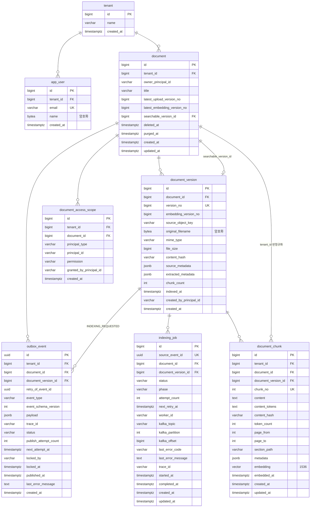

# 데이터베이스 스키마

| 항목        | 값                                               |
|-----------|-------------------------------------------------|
| 기준 마이그레이션 | `V20260825_001__add_document_chunk_content_tokens.sql` |
| 최종 수정     | 2026-08-26                                      |
| 대상 DB     | PostgreSQL 17.8 (local) / Tmax OpenSQL v3.0 (dev) |

스키마는 API 서버 저장소가 소유하고, 릴레이와 Worker 는 마이그레이션 없이 읽고 씁니다.
상태 전이는 세 저장소의 코드를 함께 확인해 적었습니다 — server `5d35737`, relay `d83e82d`, worker `029527c`.

---

## 1. 전체 구조

---

## 2. 테이블

### 2.1 `tenant`

테넌트. 모든 데이터의 격리 단위입니다.

| 컬럼           | 타입             | 제약                | 설명    |
|--------------|----------------|-------------------|-------|
| `id`         | `BIGINT`       | PK, identity      |       |
| `name`       | `VARCHAR(100)` | `NOT NULL`        |       |
| `created_at` | `TIMESTAMPTZ`  | `NOT NULL`, 기본 현재 |       |

### 2.2 `app_user`

사용자. `user` 는 PostgreSQL 예약어라 `app_user` 를 씁니다.

| 컬럼           | 타입             | 제약                                  | 설명                    |
|--------------|----------------|-------------------------------------|-----------------------|
| `id`         | `BIGINT`       | PK, identity                        |                       |
| `tenant_id`  | `BIGINT`       | `NOT NULL`, FK → `tenant(id)`       |                       |
| `email`      | `VARCHAR(255)` | `NOT NULL`, `(tenant_id, email)` UK | 평문. UNIQUE 제약과 로그인 조회용 |
| `name`       | `BYTEA`        | `NOT NULL`                          | 암호화 대상                |
| `created_at` | `TIMESTAMPTZ`  | `NOT NULL`, 기본 현재                   |                       |

### 2.3 `document`

문서. 버전 카운터와 삭제 시각을 가집니다.

| 컬럼                            | 타입             | 제약                                                    | 설명                                          |
|-------------------------------|----------------|-------------------------------------------------------|---------------------------------------------|
| `id`                          | `BIGINT`       | PK, identity                                          |                                             |
| `tenant_id`                   | `BIGINT`       | `NOT NULL`, FK → `tenant(id)`, `(id, tenant_id)` UK   | 하위 테이블의 복합 FK 대상                            |
| `owner_principal_id`          | `VARCHAR(255)` | `NOT NULL`                                            |                                             |
| `title`                       | `VARCHAR(255)` | `NOT NULL`                                            |                                             |
| `latest_upload_version_no`    | `BIGINT`       | `NOT NULL`, 기본 `0`, `>= 0`                            | 마지막으로 발급된 `version_no`. 다음 버전 채번 카운터        |
| `latest_embedding_version_no` | `BIGINT`       | `NOT NULL`, 기본 `0`, `>= 0`, `<= latest_upload_version_no` | 임베딩이 완료된 가장 최신 `version_no`                 |
| `searchable_version_id`       | `BIGINT`       | FK → `document_version(id, document_id)`              | 검색 대상 버전. `latest_embedding_version_no` 이하만 지정 |
| `deleted_at`                  | `TIMESTAMPTZ`  |                                                       | 삭제 요청 시각                                    |
| `purged_at`                   | `TIMESTAMPTZ`  | `deleted_at IS NOT NULL` 일 때만 값 허용                     | 물리 정리 완료 시각. 현재 어느 저장소도 이 컬럼을 쓰지 않습니다 (5장) |
| `created_at` / `updated_at`   | `TIMESTAMPTZ`  | `NOT NULL`, 기본 현재                                     |                                             |

### 2.4 `document_version`

업로드 단위. 한 문서의 각 업로드가 한 행입니다.

| 컬럼                        | 타입              | 제약                                                           | 설명                |
|---------------------------|-----------------|--------------------------------------------------------------|-------------------|
| `id`                      | `BIGINT`        | PK, identity, `(id, document_id)` UK                         |                   |
| `document_id`             | `BIGINT`        | `NOT NULL`, FK → `document(id)`                              |                   |
| `version_no`              | `BIGINT`        | `NOT NULL`, `> 0`, `(document_id, version_no)` UK            | 문서 내 순번           |
| `embedding_version_no`    | `BIGINT`        | `NOT NULL`, `> 0`                                            | 검색 버전 승격 순서를 결정. API 서버가 `version_no` 와 같은 값으로 채웁니다 |
| `source_object_key`       | `VARCHAR(1024)` | `NOT NULL`                                                   | 원본 오브젝트 스토리지 키    |
| `original_filename`       | `BYTEA`         | `NOT NULL`                                                   | 암호화 대상            |
| `mime_type`               | `VARCHAR(100)`  | `NOT NULL`                                                   |                   |
| `file_size`               | `BIGINT`        | `NOT NULL`, `>= 0`                                           | 바이트               |
| `content_hash`            | `VARCHAR(128)`  | `NOT NULL`                                                   |                   |
| `source_metadata`         | `JSONB`         |                                                              | 업로드 시 함께 받은 메타데이터 |
| `extracted_metadata`      | `JSONB`         |                                                              | AI 가 생성한 메타데이터    |
| `chunk_count`             | `INTEGER`       | `NULL` 이거나 `>= 0`                                            | Worker 가 발행 단계에서 채웁니다 |
| `indexed_at`              | `TIMESTAMPTZ`   |                                                              | Worker 가 `chunk_count` 와 함께 채웁니다 |
| `created_by_principal_id` | `VARCHAR(255)`  | `NOT NULL`                                                   |                   |
| `created_at`              | `TIMESTAMPTZ`   | `NOT NULL`, 기본 현재                                            |                   |

### 2.5 `document_chunk`

검색 단위. 임베딩과 키워드 토큰을 함께 가집니다. `tenant_id` 는 `document` 에서 내려온 반정규화 컬럼입니다.

| 컬럼                          | 타입              | 제약                                                        | 설명                                            |
|-----------------------------|-----------------|-----------------------------------------------------------|-----------------------------------------------|
| `id`                        | `BIGINT`        | PK, identity                                              |                                               |
| `tenant_id`                 | `BIGINT`        | `NOT NULL`, `(document_id, tenant_id)` FK → `document`    |                                               |
| `document_id`               | `BIGINT`        | `NOT NULL`                                                |                                               |
| `document_version_id`       | `BIGINT`        | `NOT NULL`, `(document_version_id, document_id)` FK       |                                               |
| `chunk_no`                  | `INTEGER`       | `NOT NULL`, `>= 0`, `(document_version_id, chunk_no)` UK  | 버전 내 순번                                       |
| `content`                   | `TEXT`          | `NOT NULL`                                                | 청크 원문                                         |
| `content_tokens`            | `TEXT`          |                                                           | Nori 형태소 분석으로 정규화한 토큰(공백 구분). `NULL` 이면 키워드 후보 조회에서 제외 |
| `content_hash`              | `VARCHAR(128)`  | `NOT NULL`                                                |                                               |
| `token_count`               | `INTEGER`       | `NULL` 이거나 `>= 0`                                         |                                               |
| `page_from` / `page_to`     | `INTEGER`       | 둘 다 있으면 `page_from <= page_to`                            |                                               |
| `section_path`              | `VARCHAR(1024)` |                                                           |                                               |
| `metadata`                  | `JSONB`         |                                                           |                                               |
| `embedding`                 | `VECTOR(1536)`  | `NOT NULL`                                                | HNSW 코사인 인덱스 대상                               |
| `embedded_at`               | `TIMESTAMPTZ`   | `NOT NULL`                                                |                                               |
| `created_at` / `updated_at` | `TIMESTAMPTZ`   | `NOT NULL`, 기본 현재                                         |                                               |

### 2.6 `document_access_scope`

문서 접근 권한. 문서 조회와 검색은 이 테이블만 참조합니다.

| 컬럼                        | 타입             | 제약                                                                  | 설명                                       |
|---------------------------|----------------|---------------------------------------------------------------------|------------------------------------------|
| `id`                      | `BIGINT`       | PK, identity                                                        |                                          |
| `tenant_id`               | `BIGINT`       | `NOT NULL`, `(document_id, tenant_id)` FK → `document`              |                                          |
| `document_id`             | `BIGINT`       | `NOT NULL`                                                          |                                          |
| `principal_type`          | `VARCHAR(30)`  | `NOT NULL`, `USER` / `TENANT`                                       |                                          |
| `principal_id`            | `VARCHAR(255)` | `NOT NULL`, `(document_id, principal_type, principal_id)` UK        | `TENANT` 면 `tenant_id` 의 문자열              |
| `permission`              | `VARCHAR(20)`  | `NOT NULL`, 기본 `READ`, `READ` / `WRITE` / `ADMIN`                   |                                          |
| `granted_by_principal_id` | `VARCHAR(255)` | `NOT NULL`                                                          |                                          |
| `created_at`              | `TIMESTAMPTZ`  | `NOT NULL`, 기본 현재                                                   |                                          |

### 2.7 `outbox_event`

트랜잭셔널 아웃박스. 릴레이 서버가 폴링해 발행합니다.

| 컬럼                      | 타입             | 제약                                                       | 설명                                                      |
|-------------------------|----------------|----------------------------------------------------------|---------------------------------------------------------|
| `id`                    | `UUID`         | PK                                                       | 트리거에서 `gen_random_uuid()` 로 채웁니다                        |
| `tenant_id`             | `BIGINT`       | `NOT NULL`, `(document_id, tenant_id)` FK → `document`   |                                                         |
| `document_id`           | `BIGINT`       | `NOT NULL`                                               |                                                         |
| `document_version_id`   | `BIGINT`       | `(document_version_id, document_id)` FK                  | `INDEXING_REQUESTED` 는 값을 가지고 `DOCUMENT_DELETED` 는 `NULL` |
| `retry_of_event_id`     | `UUID`         |                                                          | 재발행 건이 가리키는 원본 이벤트. 신규는 `NULL`                          |
| `event_type`            | `VARCHAR(50)`  | `NOT NULL`, `INDEXING_REQUESTED` / `DOCUMENT_DELETED`    |                                                         |
| `event_schema_version`  | `INTEGER`      | `NOT NULL`, 기본 `1`, `> 0`                                |                                                         |
| `payload`               | `JSONB`        | `NOT NULL`                                               |                                                         |
| `trace_id`              | `VARCHAR(255)` |                                                          | 트랜잭션에서 `SET LOCAL app.trace_id` 로 넘긴 값                   |
| `status`                | `VARCHAR(20)`  | `NOT NULL`, 기본 `PENDING`                                 | 3장 참고                                                   |
| `publish_attempt_count` | `INTEGER`      | `NOT NULL`, 기본 `0`, `>= 0`                               |                                                         |
| `next_attempt_at`       | `TIMESTAMPTZ`  | `NOT NULL`, 기본 현재                                        | 이 시각부터 발행 대상. `DEAD` 행에서 `'infinity'` 는 사람이 정지시킨 상태를 뜻합니다 |
| `locked_by`             | `VARCHAR(255)` |                                                          | 이 행을 집은 릴레이 인스턴스                                        |
| `locked_at`             | `TIMESTAMPTZ`  |                                                          | `PUBLISHING` 으로 바뀐 시각. 발행 중 죽은 행 회수 기준                   |
| `published_at`          | `TIMESTAMPTZ`  |                                                          |                                                         |
| `last_error_message`    | `TEXT`         |                                                          |                                                         |
| `created_at`            | `TIMESTAMPTZ`  | `NOT NULL`, 기본 현재                                        |                                                         |

### 2.8 `indexing_job`

Worker 의 인덱싱 처리 이력.

| 컬럼                          | 타입             | 제약                                                  | 설명                              |
|-----------------------------|----------------|-----------------------------------------------------|---------------------------------|
| `id`                        | `BIGINT`       | PK, identity                                        |                                 |
| `source_event_id`           | `UUID`         | `NOT NULL`, UK                                      | 원본 아웃박스 이벤트. FK 는 걸지 않습니다 (4장)  |
| `document_id`               | `BIGINT`       | `NOT NULL`, `(document_version_id, document_id)` FK |                                 |
| `document_version_id`       | `BIGINT`       | `NOT NULL`                                          |                                 |
| `status`                    | `VARCHAR(30)`  | `NOT NULL`                                          | 3장 참고                           |
| `phase`                     | `VARCHAR(30)`  |                                                     | 현재 처리 단계. `DOWNLOADING` / `PARSING` / `CHUNKING` / `EMBEDDING` |
| `attempt_count`             | `INTEGER`      | `NOT NULL`, 기본 `0`, `>= 0`                          |                                 |
| `next_retry_at`             | `TIMESTAMPTZ`  |                                                     |                                 |
| `worker_id`                 | `VARCHAR(255)` |                                                     |                                 |
| `kafka_topic`               | `VARCHAR(255)` | `NOT NULL`, 공백 불가                                   | 수신한 Kafka record 의 topic        |
| `kafka_partition`           | `INTEGER`      | `NOT NULL`, `>= 0`                                  |                                 |
| `kafka_offset`              | `BIGINT`       | `NOT NULL`, `>= 0`                                  |                                 |
| `last_error_code`           | `VARCHAR(100)` |                                                     | Worker 가 분류한 실패 코드. `MAX_ATTEMPTS_EXCEEDED` / `DOCUMENT_DELETED` 는 고정 값입니다 |
| `last_error_message`        | `TEXT`         |                                                     |                                 |
| `trace_id`                  | `VARCHAR(255)` |                                                     |                                 |
| `started_at`                | `TIMESTAMPTZ`  |                                                     |                                 |
| `completed_at`              | `TIMESTAMPTZ`  |                                                     |                                 |
| `created_at` / `updated_at` | `TIMESTAMPTZ`  | `NOT NULL`, 기본 현재                                   |                                 |

---

## 3. 상태값

### `outbox_event.status`

값을 전이시키는 것은 릴레이 저장소(`doc-relay`)입니다. API 서버는 트리거로 `PENDING` 행을 넣기만 합니다.

| 값            | 의미                                                       |
|--------------|----------------------------------------------------------|
| `PENDING`    | 발행 대기. `next_attempt_at <= now()` 인 행이 선점 대상입니다        |
| `PUBLISHING` | 릴레이가 선점해 발행 중. `locked_by` / `locked_at` 이 함께 채워집니다     |
| `PUBLISHED`  | Kafka 가 수신 응답을 준 상태                                      |
| `DEAD`       | 발행을 멈춘 상태. 종착역이 아니며, 영구 실패로 정지시킨 행만 자동 복구에서 빠집니다        |

| 전이                                | 계기                                                                     |
|-----------------------------------|------------------------------------------------------------------------|
| `PENDING` → `PUBLISHING`          | 릴레이 선점 (`FOR UPDATE SKIP LOCKED`)                                      |
| `PUBLISHING` → `PUBLISHED`        | Kafka 수신 응답                                                            |
| `PUBLISHING` → `PENDING`          | 재시도 가능한 실패. `publish_attempt_count` 를 올리고 백오프만큼 `next_attempt_at` 을 미룹니다 |
| `PUBLISHING` → `DEAD` (일시 실패 누적) | 재시도 한도 도달. `next_attempt_at` 에 복구 대기 시각이 들어가 나중에 자동으로 되살아납니다            |
| `PUBLISHING` → `DEAD` (영구 실패)    | 재시도해도 결과가 달라지지 않는 실패. 1회 만에 `next_attempt_at = 'infinity'` 로 정지시킵니다   |
| `PUBLISHING` → `PENDING` (회수)     | `locked_at` 이 잠금 타임아웃을 넘긴 행. 한도를 넘겼어도 `DEAD` 로 내리지 않고 항상 `PENDING` 입니다 |
| `DEAD` → `PENDING`                | 복구 스케줄러가 `next_attempt_at <= now()` 인 행을 되살립니다. 시도 횟수는 `0` 으로 초기화됩니다   |
| `DEAD` → `PENDING` (수동)           | 어드민 재발행. 새 행을 만들지 않고 같은 행을 되돌립니다                                       |
| `PUBLISHED` → `PENDING` (수동)      | 어드민 강제 재발행. 브로커 재시작 등으로 기록과 달리 유실된 메시지를 다시 보냅니다                       |

`DEAD` 에는 두 종류가 있고 `next_attempt_at` 으로 구분합니다.

| `next_attempt_at` | 의미                                             |
|-------------------|------------------------------------------------|
| 시각                | 그 시각이 지나면 복구 스케줄러가 자동으로 `PENDING` 으로 되살립니다      |
| `'infinity'`      | 영구 실패로 판정됐거나 사람이 정지시킨 행. 정지를 풀기 전까지 되살아나지 않습니다     |

영구 실패로 분류하는 것은 봉투 조립 실패와 Kafka 의 `RecordTooLargeException` / `TopicAuthorizationException` / `InvalidTopicException` 넷입니다. 확신이 없는 실패는 일시로 둡니다.

### `indexing_job.status`

값을 전이시키는 것은 Worker 저장소입니다. API 서버는 읽기만 합니다.

| 값            | 의미                       |
|--------------|--------------------------|
| `PENDING`    | Kafka record 수신 직후, 처리 전 |
| `PROCESSING` | Worker 처리 중              |
| `RETRY_WAIT` | 실패 후 `next_retry_at` 까지 대기 |
| `COMPLETED`  | 완료                       |
| `FAILED`     | 최종 실패                    |

| 전이                                             | 계기                                                                    |
|------------------------------------------------|-----------------------------------------------------------------------|
| (없음) → `PENDING`                               | `INDEXING_REQUESTED` 수신 시 `ON CONFLICT DO NOTHING` 삽입                  |
| `PENDING` / `PROCESSING` / `RETRY_WAIT` → `PROCESSING` | 처리 시작. `attempt_count` 를 올리고 `worker_id` 를 찍습니다. `attempt_count` 가 상한이면 선점 자체가 실패합니다 |
| `PROCESSING` → `RETRY_WAIT`                    | 재시도 가능한 실패. `next_retry_at` 을 찍습니다                                    |
| `PROCESSING` → `COMPLETED`                     | 발행 완료. 가드 없이 덮어씁니다                                                    |
| `PROCESSING` → `FAILED`                        | 재시도 한도 도달, 또는 재시도 불가 실패                                               |
| `PENDING` / `PROCESSING` → `FAILED`            | 상한 초과로 선점이 막힌 행 종결. `last_error_code = 'MAX_ATTEMPTS_EXCEEDED'`       |
| `PENDING` / `PROCESSING` / `RETRY_WAIT` → `FAILED` | 문서 삭제로 활성 Job 종결. `last_error_code = 'DOCUMENT_DELETED'`               |

한 `document_version` 에 `PENDING` / `PROCESSING` / `RETRY_WAIT` 인 Job 은 부분 유니크 인덱스로 하나만 존재합니다.

### `indexing_job.phase`

처리 단계는 각 단계에 **진입하기 직전에** 기록합니다.

`DOWNLOADING` → `PARSING` → `CHUNKING` → `EMBEDDING`

---

## 4. 참조 규칙

- **테넌트 격리**: 하위 테이블은 `(document_id, tenant_id)` 복합 FK 로 `document` 를 참조합니다. `document_id` 만으로는 다른 테넌트의 문서를 붙일 수 없습니다.
- **버전 정합**: 청크·Job·아웃박스는 `(document_version_id, document_id)` 복합 FK 를 씁니다.
- **`searchable_version_id`**: `document` → `document_version` 방향의 역참조 FK 입니다. `document_version` 생성 후 `ALTER TABLE` 로 추가합니다.
- **`indexing_job.source_event_id`**: FK 를 걸지 않습니다. 아웃박스 행은 발행 후 정리할 수 있어야 하지만 Job 이력은 더 오래 남깁니다.

---

## 5. 쓰기 소유권

한 스키마를 세 저장소가 함께 씁니다. 컬럼별로 쓰는 쪽이 갈리므로 정리해 둡니다.

| 대상                                                                    | 쓰는 쪽    |
|-----------------------------------------------------------------------|---------|
| 마이그레이션 전체                                                             | API 서버  |
| `tenant`, `app_user`, `document_access_scope`                         | API 서버  |
| `document` 생성, `title`, `latest_upload_version_no`, `deleted_at`       | API 서버  |
| `document_version` 삽입 (`embedding_version_no` 포함)                      | API 서버  |
| `outbox_event` 삽입                                                     | DB 트리거  |
| `outbox_event` 상태·잠금·재시도 컬럼                                           | 릴레이     |
| `outbox_event.retry_of_event_id`                                      | API 서버 (인덱싱 재시도 요청 시) |
| `indexing_job` 전체                                                     | Worker  |
| `document_chunk` 전체                                                   | Worker  |
| `document_version.chunk_count`, `indexed_at`                          | Worker  |
| `document.searchable_version_id`, `latest_embedding_version_no`       | Worker  |

승격 규칙: Worker 는 후보 버전의 `embedding_version_no` 가 현재 `searchable_version_id` 의 그것보다 클 때만 승격합니다. 삭제된 문서(`deleted_at IS NOT NULL`)는 승격 대상에서 빠지므로, 늦게 끝난 옛 Job 이 검색 버전을 되돌리지 못합니다.

삭제 정리: Worker 는 `deleted_at` 이 찍혔는데 청크가 남은 문서를 스윕해 `document_chunk` 를 지웁니다. 청크가 사라지면 다음 스윕에서 잡히지 않으므로 완료 마커가 필요 없고, 그래서 `document.purged_at` 은 스키마에만 있고 실제로 채워지지 않습니다. `idx_document_pending_purge` 도 같은 이유로 현재 쓰이지 않습니다.

---

## 6. 인덱스

| 인덱스                                    | 대상                                                   | 용도                    |
|----------------------------------------|------------------------------------------------------|-----------------------|
| `idx_document_tenant_active`           | `document (tenant_id, id) WHERE deleted_at IS NULL`   | 테넌트 문서 목록             |
| `idx_document_pending_purge`           | `document (deleted_at) WHERE deleted_at IS NOT NULL AND purged_at IS NULL` | 삭제 정리 스케줄러 스캔         |
| `idx_document_version_document`        | `document_version (document_id, version_no DESC)`     | 버전 목록                 |
| `idx_outbox_pending`                   | `outbox_event (next_attempt_at, id) WHERE status = 'PENDING'` | 릴레이 폴링                |
| `idx_outbox_stuck`                     | `outbox_event (locked_at) WHERE status = 'PUBLISHING'` | 좀비 행 회수               |
| `idx_outbox_indexing_event_version`    | `outbox_event (document_version_id, created_at DESC) WHERE event_type = 'INDEXING_REQUESTED'` | 버전별 인덱싱 이벤트 조회        |
| `uq_indexing_job_active_version`       | `indexing_job (document_version_id) WHERE status IN ('PENDING','PROCESSING','RETRY_WAIT')` | 진행 중 Job 중복 방지 (UNIQUE) |
| `idx_indexing_job_retry`               | `indexing_job (status, next_retry_at) WHERE status IN ('PENDING','RETRY_WAIT')` | 재시도 대상 조회             |
| `idx_indexing_job_version`             | `indexing_job (document_version_id, created_at DESC)`  | 버전별 인덱싱 이력            |
| `idx_chunk_document_version`           | `document_chunk (document_version_id, chunk_no)`       | 버전별 청크 조회             |
| `idx_document_chunk_embedding_hnsw`    | `document_chunk USING hnsw (embedding vector_cosine_ops)`, `m = 16`, `ef_construction = 64` | 벡터 유사도 검색             |
| `idx_document_chunk_content_tokens_tsv` | `document_chunk USING GIN (to_tsvector('simple', content_tokens))` | 키워드 후보 회수 (BM25 경로)   |
| `idx_document_chunk_content_tsv`       | `document_chunk USING GIN (to_tsvector('simple', content))` | 원문 기준 키워드 검색 (대체 경로)  |
| `idx_access_scope_principal`           | `document_access_scope (tenant_id, principal_type, principal_id, document_id)` | 권한 있는 문서 조회           |

---

## 7. 트리거

| 트리거                             | 시점                                                         | 동작                                                                 |
|---------------------------------|------------------------------------------------------------|--------------------------------------------------------------------|
| `trg_document_version_outbox`   | `AFTER INSERT ON document_version`                         | `INDEXING_REQUESTED` 아웃박스 행 삽입 후 `pg_notify('outbox_event', <id>)` |
| `trg_document_deleted_outbox`   | `AFTER UPDATE ON document` (`deleted_at` 이 `NULL` → 값일 때만) | `DOCUMENT_DELETED` 아웃박스 행 삽입 후 `pg_notify`                          |

알림은 유실될 수 있으므로 릴레이는 폴링도 함께 수행해야 합니다. `pg_notify` 는 8000바이트 제한이 있어 ID 만 보내고 릴레이가 다시 조회합니다.

---

## 8. 암호화

`app_user.name` 과 `document_version.original_filename` 은 `BYTEA` 로 저장하고 쿼리 시점에 함수로 암복호화합니다.

| 함수                     | 설명                                                                                        |
|------------------------|-------------------------------------------------------------------------------------------|
| `app_encrypt(bytea)`   | `app.encryption_key` 세션 설정으로 암호화. 알고리즘은 `app.encryption_cipher`(기본 `aria256`)로 지정합니다 |
| `app_decrypt(bytea)`   | `app.encryption_key` 세션 설정으로 복호화                                                          |

`app_user.email` 은 UNIQUE 제약과 로그인 조회에 쓰이므로 암호화 대상에서 제외했습니다.

확장은 `vector` 만 스키마에서 생성합니다. `opencrypto` 는 설치하지 않으며, 컬럼 타입은 확장과 무관하므로 확장이 없는 local 에서도 스키마 생성은 성공합니다.
